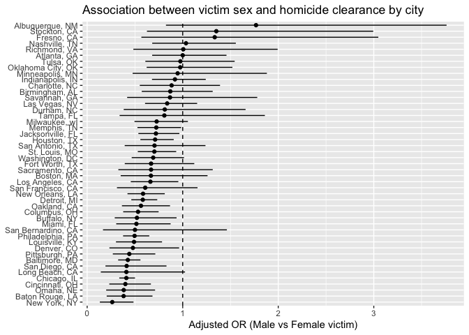
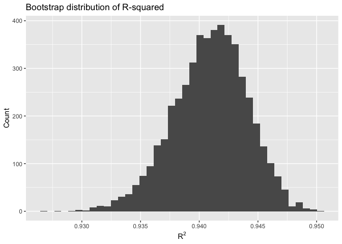
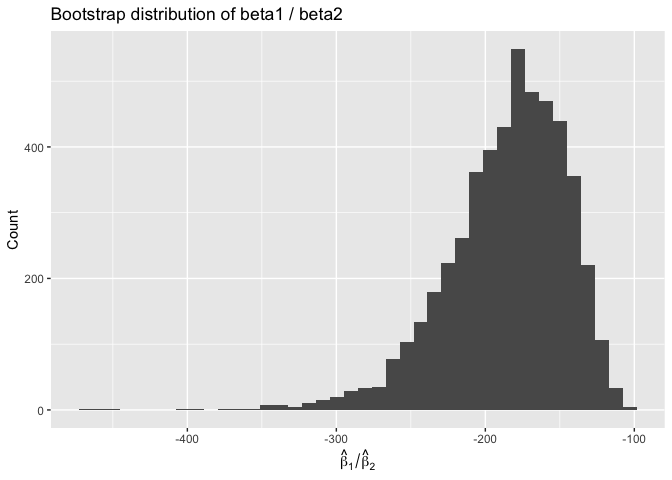
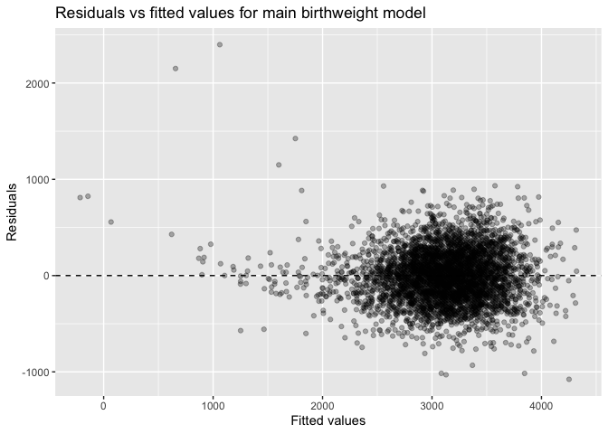
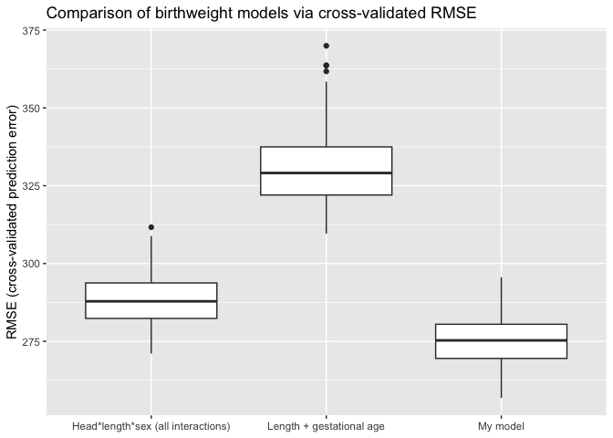

p8105_hw6_yc4804
================
Yilin Cai
2025-12-03

## Problem 1

``` r
#data preparation
library(tidyverse)
```

    ## ── Attaching core tidyverse packages ──────────────────────── tidyverse 2.0.0 ──
    ## ✔ dplyr     1.1.4     ✔ readr     2.1.5
    ## ✔ forcats   1.0.0     ✔ stringr   1.5.1
    ## ✔ ggplot2   3.5.2     ✔ tibble    3.3.0
    ## ✔ lubridate 1.9.4     ✔ tidyr     1.3.1
    ## ✔ purrr     1.1.0     
    ## ── Conflicts ────────────────────────────────────────── tidyverse_conflicts() ──
    ## ✖ dplyr::filter() masks stats::filter()
    ## ✖ dplyr::lag()    masks stats::lag()
    ## ℹ Use the conflicted package (<http://conflicted.r-lib.org/>) to force all conflicts to become errors

``` r
library(broom)

homicide <- 
  read_csv("data/homicide-data.csv") %>%
  mutate(
    # City, State label
    city_state = str_c(city, ", ", state),
    
    # Binary solved indicator
    solved = case_when(
      disposition == "Closed by arrest" ~ 1,
      disposition %in% c("Open/No arrest", "Closed without arrest") ~ 0,
      TRUE ~ NA_real_
    ),
    
    # Make sure age is numeric
    victim_age = as.numeric(victim_age)
  ) %>%
  # Drop cities with race issues / data errors
  filter(
    !city_state %in% c("Dallas, TX", "Phoenix, AZ", "Kansas City, MO", "Tulsa, AL")
  ) %>%
  # Keep only Black / White victims
  filter(victim_race %in% c("White", "Black")) %>%
  # Keep only Male / Female (drop “Unknown”, etc.)
  filter(victim_sex %in% c("Male", "Female"))
```

    ## Warning: One or more parsing issues, call `problems()` on your data frame for details,
    ## e.g.:
    ##   dat <- vroom(...)
    ##   problems(dat)

    ## Rows: 52179 Columns: 12
    ## ── Column specification ────────────────────────────────────────────────────────
    ## Delimiter: ","
    ## chr (9): uid, victim_last, victim_first, victim_race, victim_age, victim_sex...
    ## dbl (3): reported_date, lat, lon
    ## 
    ## ℹ Use `spec()` to retrieve the full column specification for this data.
    ## ℹ Specify the column types or set `show_col_types = FALSE` to quiet this message.

    ## Warning: There was 1 warning in `mutate()`.
    ## ℹ In argument: `victim_age = as.numeric(victim_age)`.
    ## Caused by warning:
    ## ! NAs introduced by coercion

``` r
view(homicide)
```

``` r
baltimore <- 
  homicide %>%
  filter(city_state == "Baltimore, MD") %>%
  drop_na(solved, victim_age, victim_sex, victim_race)

baltimore_fit <- glm(
  solved ~ victim_age + victim_sex + victim_race,
  data   = baltimore,
  family = binomial()
)

baltimore_or <- 
  baltimore_fit %>%
  tidy(exponentiate = TRUE, conf.int = TRUE) %>%
  filter(term == "victim_sexMale") %>%
  select(term, estimate, conf.low, conf.high)

baltimore_or
```

    ## # A tibble: 1 × 4
    ##   term           estimate conf.low conf.high
    ##   <chr>             <dbl>    <dbl>     <dbl>
    ## 1 victim_sexMale    0.426    0.324     0.558

``` r
library(purrr)

city_ors <- 
  homicide %>%
  drop_na(solved, victim_age, victim_sex, victim_race) %>%
  group_by(city_state) %>%
  nest() %>%
  mutate(
    # Fit logistic model for each city
    fit = map(
      data,
      ~ glm(
        solved ~ victim_age + victim_sex + victim_race,
        data   = .x,
        family = binomial()
      )
    ),
    # Tidy each model, returning ORs + CIs
    tidy = map(fit, ~ tidy(.x, exponentiate = TRUE, conf.int = TRUE))
  ) %>%
  unnest(tidy) %>%
  # Keep only the Male vs Female contrast
  filter(term == "victim_sexMale") %>%
  ungroup() %>%
  select(city_state, estimate, conf.low, conf.high)

city_ors
```

    ## # A tibble: 47 × 4
    ##    city_state      estimate conf.low conf.high
    ##    <chr>              <dbl>    <dbl>     <dbl>
    ##  1 Albuquerque, NM    1.77     0.825     3.76 
    ##  2 Atlanta, GA        1.00     0.680     1.46 
    ##  3 Baltimore, MD      0.426    0.324     0.558
    ##  4 Baton Rouge, LA    0.381    0.204     0.684
    ##  5 Birmingham, AL     0.870    0.571     1.31 
    ##  6 Boston, MA         0.667    0.351     1.26 
    ##  7 Buffalo, NY        0.521    0.288     0.936
    ##  8 Charlotte, NC      0.884    0.551     1.39 
    ##  9 Chicago, IL        0.410    0.336     0.501
    ## 10 Cincinnati, OH     0.400    0.231     0.667
    ## # ℹ 37 more rows

``` r
library(forcats)
library(ggplot2)

city_ors %>%
  mutate(city_state = fct_reorder(city_state, estimate)) %>%
  ggplot(aes(x = city_state, y = estimate)) +
  geom_point() +
  geom_errorbar(aes(ymin = conf.low, ymax = conf.high), width = 0) +
  geom_hline(yintercept = 1, linetype = "dashed") +
  coord_flip() +
  labs(
    x     = NULL,
    y     = "Adjusted OR (Male vs Female victim)",
    title = "Association between victim sex and homicide clearance by city"
  )
```

<!-- -->

The dashed vertical line at OR = 1 represents the point of no difference
in homicide clearance between male and female victims. Cities with
estimates and confidence intervals entirely below this line indicate
that homicides of male victims are less likely to be solved, while
points crossing the line suggest no statistically clear difference.
Overall, most cities fall below the line, showing a consistent pattern
of lower clearance rates for male-victim homicides.

## Problem 2

``` r
library(tidyverse)
library(p8105.datasets)
library(broom)
library(modelr)
```

    ## 
    ## Attaching package: 'modelr'

    ## The following object is masked from 'package:broom':
    ## 
    ##     bootstrap

``` r
data("weather_df")

set.seed(123)   # for reproducibility

# 1. Make 5000 bootstrap samples and fit the model
#    tmax ~ tmin + prcp to each sample

boot_results <- 
  weather_df %>%
  # make 5000 bootstrap resamples
  bootstrap(n = 5000, id = "boot_id") %>%
  # fit model to each resample
  mutate(
    fit   = map(strap, ~ lm(tmax ~ tmin + prcp, data = .x)),
    glnc  = map(fit, glance),
    tidy  = map(fit, tidy)
  ) %>%
  # extract r^2
  mutate(
    r2 = map_dbl(glnc, "r.squared")
  ) %>%
  # extract β1 / β2 (tmin / prcp)
  mutate(
    beta_ratio = map_dbl(
      tidy,
      ~ .x %>%
        filter(term %in% c("tmin", "prcp")) %>%
        select(term, estimate) %>%
        pivot_wider(names_from = term, values_from = estimate) %>%
        transmute(ratio = tmin / prcp) %>%
        pull(ratio)
    )
  ) %>%
  select(boot_id, r2, beta_ratio)


# 2. Plot bootstrap distributions

# r^2 distribution
boot_results %>%
  ggplot(aes(x = r2)) +
  geom_histogram(bins = 40) +
  labs(
    x = expression(R^2),
    y = "Count",
    title = "Bootstrap distribution of R-squared"
  )
```

<!-- -->

``` r
# β1 / β2 distribution
boot_results %>%
  ggplot(aes(x = beta_ratio)) +
  geom_histogram(bins = 40) +
  labs(
    x = expression(hat(beta)[1] / hat(beta)[2]),
    y = "Count",
    title = "Bootstrap distribution of beta1 / beta2"
  )
```

<!-- -->

``` r
# 3. 95% bootstrap CIs (2.5% and 97.5% quantiles)

boot_CIs <- 
  boot_results %>%
  summarise(
    r2_lower        = quantile(r2, 0.025),
    r2_upper        = quantile(r2, 0.975),
    ratio_lower     = quantile(beta_ratio, 0.025),
    ratio_upper     = quantile(beta_ratio, 0.975)
  )

boot_CIs
```

    ## # A tibble: 1 × 4
    ##   r2_lower r2_upper ratio_lower ratio_upper
    ##      <dbl>    <dbl>       <dbl>       <dbl>
    ## 1    0.934    0.947       -279.       -125.

The bootstrap distribution of R^2 is approximately symmetric and tightly
concentrated around about 0.94, indicating that the linear model
consistently explains a very large portion of the variability in tmax.
The spread is small, with most bootstrap samples falling within a narrow
range (roughly 0.938–0.945). This suggests that the model’s explanatory
power is very stable across resampled datasets.

The distribution of the ratio beta1/beta2 is much more skewed and
substantially more variable than the distribution of R^2. Most values
fall between about –300 and –150, but the long left tail shows
occasional extreme ratios driven by very small estimated values of
beta2. This indicates that the relative size of the two coefficients is
far less stable and more sensitive to sampling variation than the
model’s overall fit.

\#Problem 3

``` r
library(tidyverse)
library(modelr)
library(broom)

set.seed(123)  # for reproducibility

birthweight <- 
  read_csv("data/birthweight.csv") %>%
  # convert appropriate variables to factors
  mutate(
    babysex = factor(babysex, levels = c(1, 2),
                     labels = c("male", "female")),
    malform = factor(malform, levels = c(0, 1),
                     labels = c("absent", "present")),
    frace = factor(frace,
                   levels = c(1, 2, 3, 4, 8, 9),
                   labels = c("White", "Black", "Asian",
                              "Puerto Rican", "Other", "Unknown")),
    mrace = factor(mrace,
                   levels = c(1, 2, 3, 4, 8),
                   labels = c("White", "Black", "Asian",
                              "Puerto Rican", "Other"))
  )
```

    ## Rows: 4342 Columns: 20
    ## ── Column specification ────────────────────────────────────────────────────────
    ## Delimiter: ","
    ## dbl (20): babysex, bhead, blength, bwt, delwt, fincome, frace, gaweeks, malf...
    ## 
    ## ℹ Use `spec()` to retrieve the full column specification for this data.
    ## ℹ Specify the column types or set `show_col_types = FALSE` to quiet this message.

``` r
# check missingness
birthweight %>% 
  summarise(across(everything(), \(x) sum(is.na(x))))
```

    ## # A tibble: 1 × 20
    ##   babysex bhead blength   bwt delwt fincome frace gaweeks malform menarche
    ##     <int> <int>   <int> <int> <int>   <int> <int>   <int>   <int>    <int>
    ## 1       0     0       0     0     0       0     0       0       0        0
    ## # ℹ 10 more variables: mheight <int>, momage <int>, mrace <int>, parity <int>,
    ## #   pnumlbw <int>, pnumsga <int>, ppbmi <int>, ppwt <int>, smoken <int>,
    ## #   wtgain <int>

``` r
# drop rows with missing data (if any)
birthweight <- birthweight %>% drop_na()
```

``` r
bw_mod_main <- lm(
  bwt ~ babysex + bhead + blength + gaweeks +
    ppbmi + smoken + wtgain + mrace +
    momage + parity,
  data = birthweight
)

summary(bw_mod_main)
```

    ## 
    ## Call:
    ## lm(formula = bwt ~ babysex + bhead + blength + gaweeks + ppbmi + 
    ##     smoken + wtgain + mrace + momage + parity, data = birthweight)
    ## 
    ## Residuals:
    ##      Min       1Q   Median       3Q      Max 
    ## -1077.17  -186.30    -4.32   177.67  2398.08 
    ## 
    ## Coefficients:
    ##                     Estimate Std. Error t value Pr(>|t|)    
    ## (Intercept)       -5782.2643   102.7580 -56.271  < 2e-16 ***
    ## babysexfemale        31.4428     8.5072   3.696 0.000222 ***
    ## bhead               131.9708     3.4655  38.081  < 2e-16 ***
    ## blength              76.5364     2.0187  37.914  < 2e-16 ***
    ## gaweeks              11.3419     1.4735   7.697 1.71e-14 ***
    ## ppbmi                 6.8647     1.3439   5.108 3.40e-07 ***
    ## smoken               -4.6182     0.5883  -7.850 5.22e-15 ***
    ## wtgain                4.1303     0.3965  10.418  < 2e-16 ***
    ## mraceBlack         -142.8886     9.8033 -14.575  < 2e-16 ***
    ## mraceAsian         -103.8852    42.7699  -2.429 0.015184 *  
    ## mracePuerto Rican  -134.8342    18.8633  -7.148 1.03e-12 ***
    ## momage                1.8033     1.1728   1.538 0.124212    
    ## parity               87.1489    40.6902   2.142 0.032268 *  
    ## ---
    ## Signif. codes:  0 '***' 0.001 '**' 0.01 '*' 0.05 '.' 0.1 ' ' 1
    ## 
    ## Residual standard error: 274.2 on 4329 degrees of freedom
    ## Multiple R-squared:  0.7142, Adjusted R-squared:  0.7134 
    ## F-statistic: 901.7 on 12 and 4329 DF,  p-value: < 2.2e-16

``` r
birthweight %>%
  add_predictions(bw_mod_main) %>%
  add_residuals(bw_mod_main) %>%
  ggplot(aes(x = pred, y = resid)) +
  geom_point(alpha = 0.3) +
  geom_hline(yintercept = 0, linetype = "dashed") +
  labs(
    x = "Fitted values",
    y = "Residuals",
    title = "Residuals vs fitted values for main birthweight model"
  )
```

<!-- -->

To construct a regression model for birthweight, I began by considering
predictors that are biologically or clinically known to influence fetal
growth. Variables that directly measure the baby’s size at birth (head
circumference and length) were included because they are strongly
correlated with birthweight. I also added gestational age, since longer
pregnancies generally result in heavier infants, and several maternal
factors—pre-pregnancy BMI, smoking, weight gain, maternal race, age, and
parity—because these capture nutritional status, health behaviors, and
demographic influences that could affect fetal development. I avoided
unnecessary interactions or highly collinear combinations to keep the
model interpretable and stable. After fitting the model, I examined a
residuals-versus-fitted plot to check for systematic patterns and verify
that the linear model assumptions were not severely violated. Overall,
this approach blends subject-matter reasoning with a data-driven check
of model performance.

``` r
# Model A: length + gestational age (main effects)
bw_mod_len_age <- lm(
  bwt ~ blength + gaweeks,
  data = birthweight
)

# Model B: head, length, sex + all interactions (including 3-way)
bw_mod_big_int <- lm(
  bwt ~ bhead * blength * babysex,
  data = birthweight
)
```

``` r
set.seed(123)

cv_df <- 
  crossv_mc(birthweight, n = 100) %>%
  mutate(
    train = map(train, as_tibble),
    test  = map(test,  as_tibble),

    # fit all three models in each training split
    mod_main = map(train, ~ lm(
      bwt ~ babysex + bhead + blength + gaweeks +
        ppbmi + smoken + wtgain + mrace +
        momage + parity,
      data = .x
    )),
    mod_len_age = map(train, ~ lm(
      bwt ~ blength + gaweeks,
      data = .x
    )),
    mod_big_int = map(train, ~ lm(
      bwt ~ bhead * blength * babysex,
      data = .x
    )),

    # compute RMSE on the test split
    rmse_main    = map2_dbl(mod_main,    test, ~ rmse(.x, .y)),
    rmse_len_age = map2_dbl(mod_len_age, test, ~ rmse(.x, .y)),
    rmse_big_int = map2_dbl(mod_big_int, test, ~ rmse(.x, .y))
  )
```

    ## Warning: There was 1 warning in `mutate()`.
    ## ℹ In argument: `rmse_main = map2_dbl(mod_main, test, ~rmse(.x, .y))`.
    ## Caused by warning in `predict.lm()`:
    ## ! prediction from rank-deficient fit; attr(*, "non-estim") has doubtful cases

``` r
cv_results <- 
  cv_df %>%
  select(starts_with("rmse_")) %>%
  pivot_longer(
    everything(),
    names_to = "model",
    values_to = "rmse"
  ) %>%
  mutate(
    model = recode(
      model,
      rmse_main    = "My model",
      rmse_len_age = "Length + gestational age",
      rmse_big_int = "Head*length*sex (all interactions)"
    )
  )

# boxplot of cross-validated RMSE by model
cv_results %>%
  ggplot(aes(x = model, y = rmse)) +
  geom_boxplot() +
  labs(
    x = NULL,
    y = "RMSE (cross-validated prediction error)",
    title = "Comparison of birthweight models via cross-validated RMSE"
  )
```

<!-- -->

``` r
cv_results %>%
  group_by(model) %>%
  summarise(mean_rmse = mean(rmse))
```

    ## # A tibble: 3 × 2
    ##   model                              mean_rmse
    ##   <chr>                                  <dbl>
    ## 1 Head*length*sex (all interactions)      288.
    ## 2 Length + gestational age                331.
    ## 3 My model                                275.

The cross-validated RMSE values show clear differences in predictive
performance among the three models. The model using only length and
gestational age performs the worst, with the highest median RMSE and the
widest spread, indicating that these two predictors alone do not capture
enough variability in birthweight. The fully interactive model using
head circumference, length, sex, and all interactions performs
substantially better, suggesting that the relationships among these
predictors are important. However, my proposed model achieves the lowest
median RMSE and the smallest variability across validation splits,
indicating that it provides the most accurate and stable predictions for
birthweight among the models considered.
